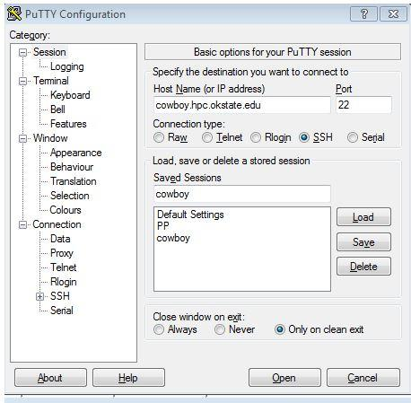
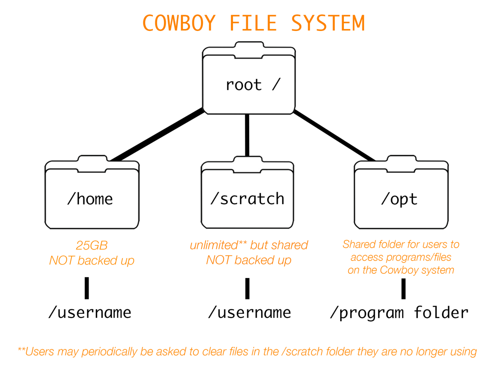
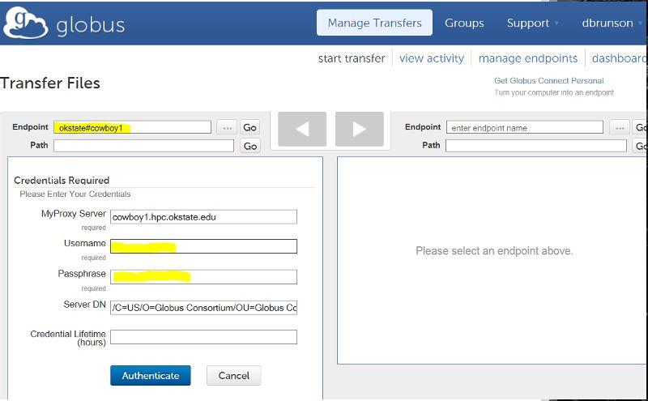
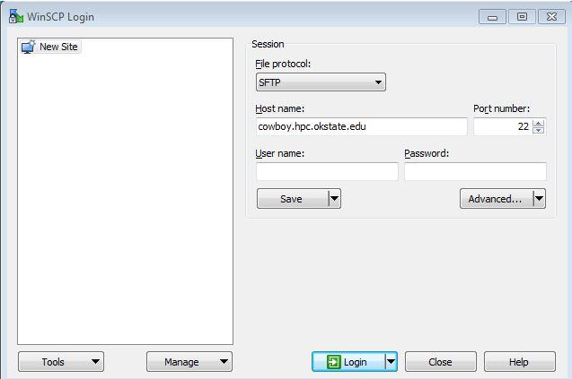
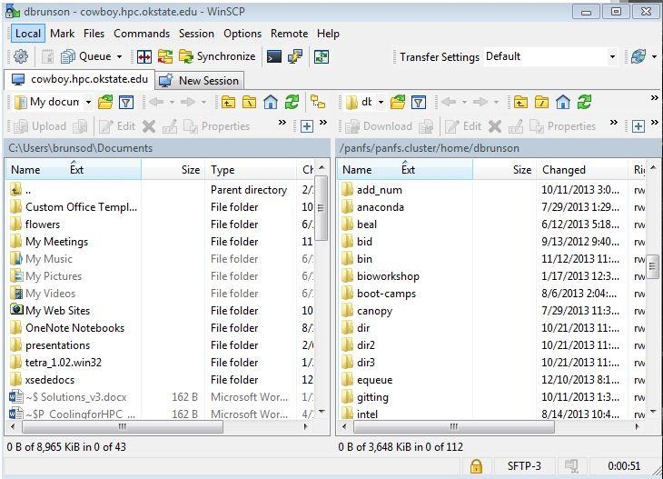
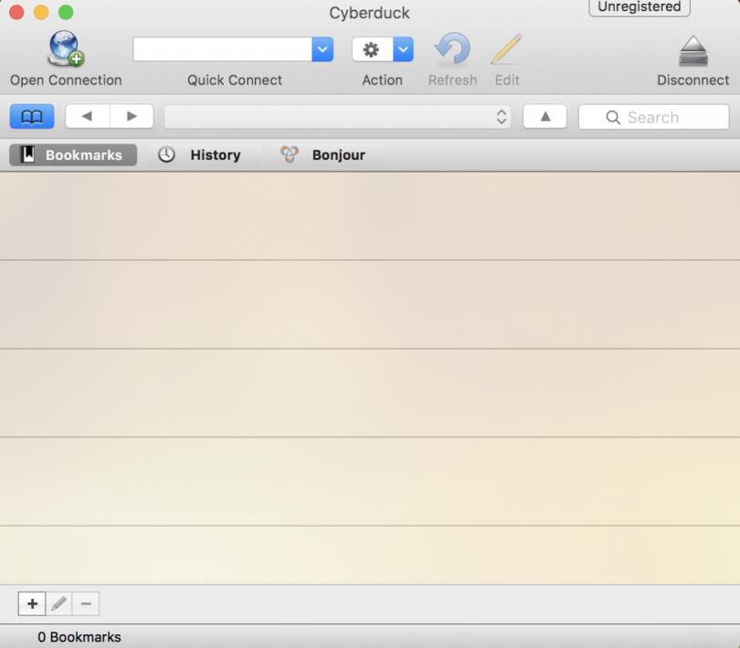
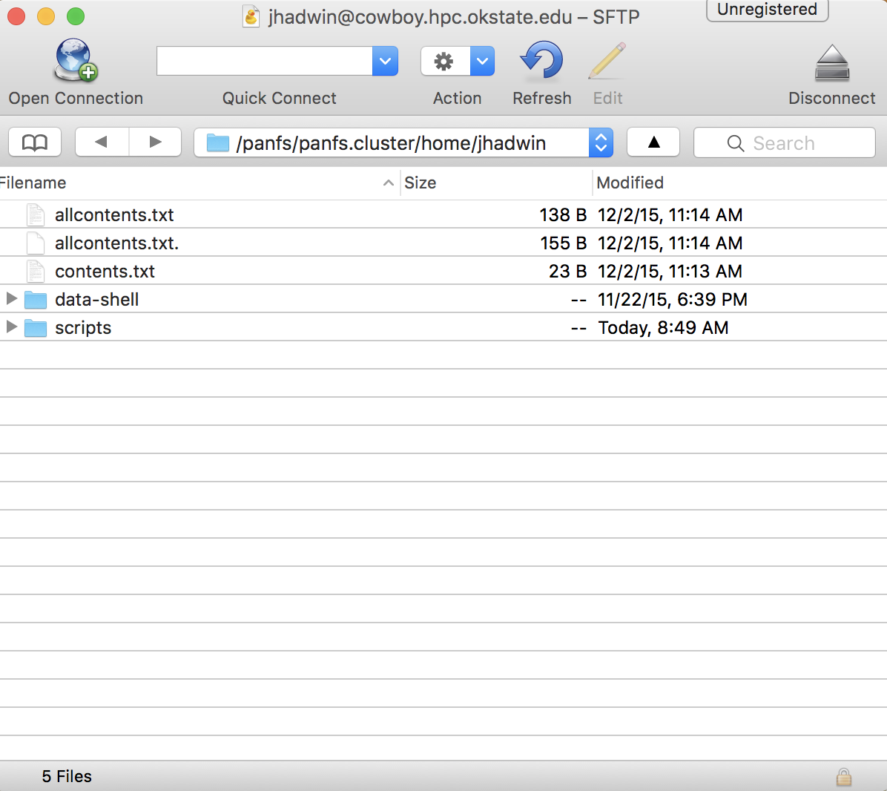
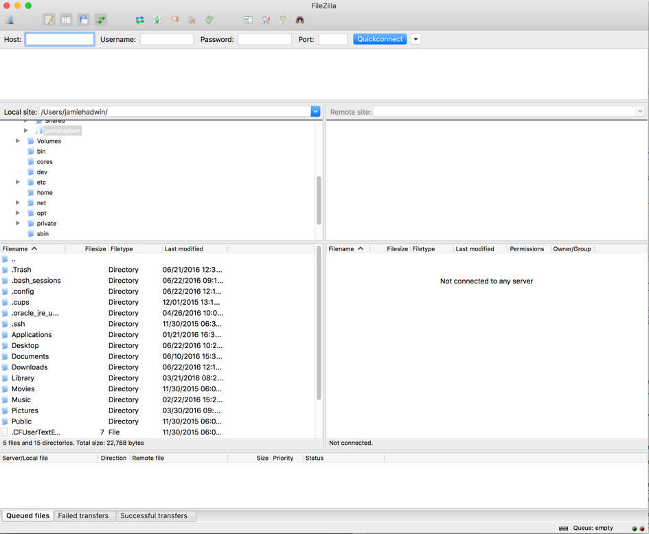
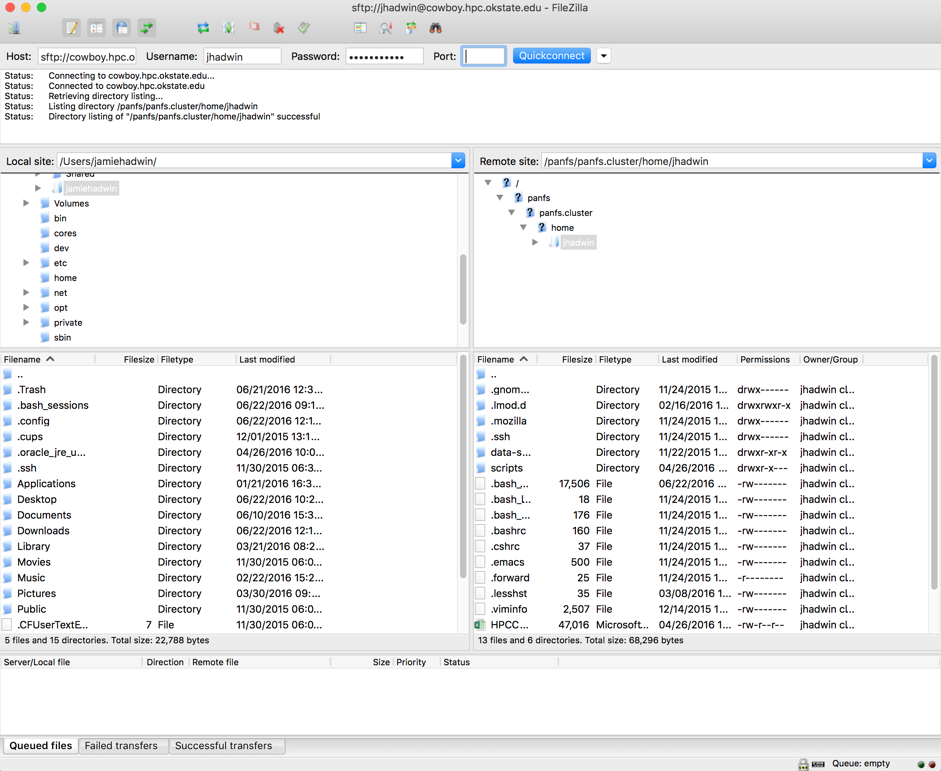
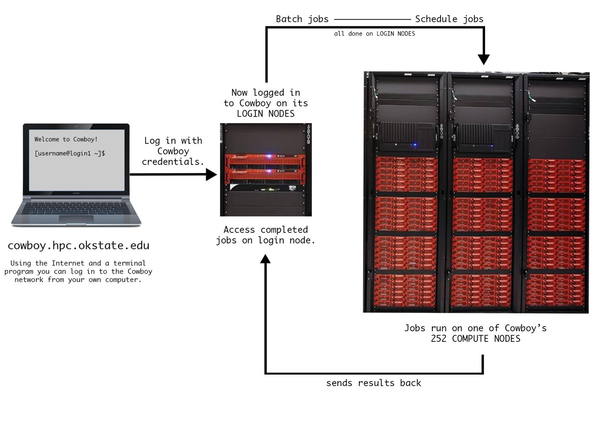

# Using a Terminal
Most computer users are familiar with a graphical user interface (GUI). A GUI consists of visual icons and directories that are navigated using a mouse. Most high performance computing (HPC) systems use a command-line interface because it allows a user to efficiently do many common HPC tasks. While there is a steep learning curve associated with using a terminal, it has a set of features that allows researchers to automate tasks, saving time and money.

# Logging into Cowboy
In order to log into Cowboy, you need to use a terminal with Secured Shell (SSH). After logging in, you will be on one of the cluster's *login nodes*. *Node* refers to a server or computer. Cowboy also includes 254 *compute nodes*. A private network connects the compute nodes together. A *cluster* consists of these nodes, the network, and a file system.

## Windows
Most Windows operating systems do not already have a terminal application. Putty is a free, open-source terminal emulator that supports SSH.

- Download Putty from the [Putty website](http://www.chiark.greenend.org.uk/~sgtatham/putty/download.html "Putty").
- Choose the file "putty.exe," save it to your desktop, then run it.
- A window will open that looks like the image below.



- Enter `cowboy.hpc.okstate.edu` in *Host Name* text box.
- Verify *Connection type* is "SSH," and Port number is `22`.
- In *Saved Sessions*, you can name these settings, i.e. `Cowboy`, and click *Save*.
- Next time you open Putty, you can double-click this saved session and it will open a login screen directly.
- After saving your settings, click *Open*. Enter your Cowboy username and press the `Enter` key.
- Enter your password, followed by the `Enter` key. Passwords are case sensitive.
> Nothing will display while you type your password. This is a security feature.
- To end your session, type `exit` or `logout`, followed by the `Enter` key.

## Linux
Linux operating systems already have a terminal application. You can launch a terminal from your computer’s application menu.

- In a terminal, type `ssh username@cowboy.hpc.okstate.edu`, where `username` is your username.
> If your username was "pete," you would enter `ssh pete@cowboy.hpc.okstate.edu`.
- Enter your password, followed by the `Enter` key. Passwords are case sensitive.
> Nothing will display while you type your password. This is a security feature.
- To end your session, type `exit` or `logout`, followed by the `Enter` key.

## Mac
Macintosh operating systems already have a terminal application.

- Open your *Finder* (hard drive) window.
- Double-click on the following sequence: `Applications` folder, `Utilities` folder, `Terminal` icon.
- In the terminal, type `ssh username@cowboy.hpc.okstate.edu`, where `username` is your username.
> If your username was "pete," you would enter `ssh pete@cowboy.hpc.okstate.edu`.
- Enter your password, followed by the `Enter` key. Passwords are case sensitive.
> Nothing will display while you type your password. This is a security feature.
- To end your session, type `exit` or `logout`, followed by the `Enter` key.

### Using your mouse
Your mouse has no function within the terminal. Apart from copy and paste commands, you can only use your keyboard.

| **System**             | **Action**                                                                        |
| ---------------------- | --------------------------------------------------------------------------------- |
| Putty                  | Highlighting with a mouse is equivalent to copy.                                  |
| Mac Terminal           | Highlighting with a mouse while holding down `Command`+`c` is equivalent to copy. |
| Linux's xterm          | Highlighting with a mouse is equivalent to copy.                                  |
| Linux's GNOME Terminal | The key combination `Ctrl`+`Shift`+`c` is equivalent to copy.                     |

| **System**             | **Action**                                         |
| ---------------------- | ----------                                         |
| Putty                  | Right-clicking is equivalent to paste.             |
| Mac Terminal           | The key combination `Command`+`v` will paste.      |
| Linux's xterm          | Middle-clicking is equivalent to paste.            |
| Linux's GNOME Terminal | The key combination `Ctrl`+`Shift`+`v` will paste. |

# Changing Your Password
It is important to change your password when you log in the first time. Change your password using the `passwd` command.

> Be on your guard against phishing emails. HPCC employees will never ask you for your password.

- After logging in, type `passwd`.
- Enter your old password, then your new password twice.
> Nothing will display while you type your password. This is a security feature.
- Please use a **strong** password.
> Passwords should be at least eight characters long and include numbers, letters, and special characters.

# Linux Commands
Below are Linux commands and terminal shortcuts that are useful on Cowboy.

| Command   | Name                    | Purpose                                                                                                                   |
| --------- | ----------------------- | ------------------------------------------------------------------------------------------------------------------------- |
| `pwd`     | Print Working Directory | Displays your current location.                                                                                           |
| `ls`      | List                    | List all the files and directories within a directory.                                                                    |
| `cd`      | Change Directory        | Moves the user to a different directory.                                                                                  | 
| `cp`      | Copy                    | Copies a file.                                                                                                            |
| `mv`      | Move                    | Moves a file (also renames a file).                                                                                       |
| `rm`      | Remove                  | *Permanantly* deletes a file.                                                                                             |
| `grep`    | Grep                    | Searches a file's contents.                                                                                               |
| `nano -w` | Nano                    | Is a text editor.                                                                                                         |
| `diff`    | Diff                    | Compares differences between files.                                                                                       |
| `tar`     | Tar                     | Creates file archives.                                                                                                    |
| `man`     | Manual                  | Allows users to look up manual entries.                                                                                   |
| `exit`    | Exit                    | Ends the session.                                                                                                         |
| `\|`      | Pipe                    | The pipe character is placed between two commands. It "pipes" the first command's output into the second command's input. |

| Shorthand | Terminal's Interpretation                    |
| --------- | -------------------------------------------- |
| `..`      | One directory up from the current directory. |
| `.`       | The current directory.                       |
| `~`       | The user's home directory.                   |

| Key Combination | Action                                            |
| --------------- | ------------------------------------------------- |
| `Tab`           | Completes partially typed commands or file names. |
| The up arrow    | Cycles through previous commands.                 |
| `Ctrl`+`d`      | Exits the terminal (same as typing `exit`).       |
| `Ctrl`+`c`      | Stops a running command.                          |

The OSU HPCC website maintains a [page](https://hpcc.okstate.edu/content/hpc-education-resources) of Linux tutorials.

# File System
Each user has access to two directories: `/home` and `/scratch`. When you log in, your working directory is `/home/username`, where `username` is your username. `/home/username` has a quota of 25GB. To check your current usage, type `du -sh`. You should store your source code and executable files here.

> OSU HPCC staff **does not** back up your home folder.

Use `/scratch/username` for large files and large file collections.

> OSU HPCC staff **does not** back up your scratch folder. If you need archival storage, please contact [Dana Brunson](mailto:dana.brunson@okstate.edu "Dana Brunson").

Users also have access to the `/opt` directory. `/opt` contains additional software.

> If Cowboy does not have software you need, send us an [email](mailto:hpcc@okstate.edu "HPCC Email") and request a software install.



# File Transfers
Several options exist for moving files between your computer and Cowboy. Globus is a file transfer application for large data transfers. Smaller data transfers can utilize one of the GUI options below. If you prefer a command-line interface, please see the last set of directions in this section.

## Globus
Globus is an online service which facilitates fault tolerant, large data transfers.

* Set up your computer as a Globus endpoint by downloading the [Globus Personal Client](https://www.globus.org/globus-connect-personal "Globus Personal Client").
* [Create an account](https://www.globusid.org/create "New Globus Account"). 
* Verify the account and log into Globus.
* Find the *Manage Data* drop-down list and click "Transfer Files".
* Your screen will look similar to this one:



* The Cowboy "Endpoint" is `okstate#cowboy1`.
* Once you have entered both endpoints, click one of the arrows to start the transfer.

For more information, visit the [Globus website](https://www.globus.org/ "Globus Website").

## WinSCP (Windows)

* Download "Portable executables" from the [WinSCP Website](http://winscp.net/eng/download.php).
* The download is a zip archive with the file *WinSCP.exe*. Place *WinSCP.exe* on your computer's desktop. This is the only file you need.
* Double-click the WinSCP icon.
* A window like the one below will open:



* In the *Host name* box, type `cowboy.hpc.okstate.edu`.
* In the *User name* box, enter your username.
> If you want to save the above information, click *Save*. In the future, you can double-click the session name directly to log in.
* Click *Login*.
* You will see a window similar to the one below once you have connected.



* The left side contains your files, and the right side has your Cowboy home directory.
* You can drag and drop files in either direction.

## Cyberduck (Windows and Mac)

* Download Cyberduck from their [website](https://cyberduck.io/ "Cyberduck Website")
* Click the *Download* icon **below** the duck.
> Warning! The *Start Download* icon on the right of the duck is an advertisement.
* After downloading and opening Cyberduck, you should see a window similar to this:



* Click the *Open Connection* icon at the top left.
* Choose the "SFTP" (SSH File Transfer Protocol) option in the drop down menu at the top.
* For *Server*, type `cowboy.hpc.okstate.edu`.
* Change the *Port* to `22`.
* Enter your Cowboy username and password.
* Click *Connect*.
* Your Cyberduck window now looks like the picture below.
* You can drag and drop files in both directions.



## FileZilla (Windows, Linux, and Mac)

* Download FileZilla from their [website](https://filezilla-project.org/ "FileZilla Website").
* Click the *Download FileZilla Client -  All platforms* icon.
* After downloading and opening FileZilla, your window looks like the following image:



* For *Host*, type `cowboy.hpc.okstate.edu`.
> `cowboy.hpc.okstate.edu` should automatically change to `sftp://cowboy.hpc.okstate.edu`.
* Enter your Cowboy username and password.
* Change *Port* to `22`.
* Click *Quickconnect*.
* Your window is now like the picture below.
* You can drag and drop files in either direction.



## Command-line File Transfers (Linux and Mac)

### Copy a file *from Cowboy* to your local machine

* Open a terminal on your local machine.
* Navigate to the directory where you want to place the file.
* Type `scp yourusername@cowboy.hpc.okstate.edu:directory_where_your_file_is_stored/yourfilename .`.
> If Pete wanted to move the file `examplefile.txt` from his scratch folder to his local computer, he would type `scp pete@cowboy.hpc.okstate.edu:/scratch/pete/data/examplefile.txt .`. The `.` is [shorthand](#linux-commands) for the current working directory.
* Enter your Cowboy password.
* You will see the file name and "100%" once the transfer completes.

### Copy a file from your local machine *to Cowboy*

* Open a terminal on your local machine.
* Navigate to the directory where your file is located.
* Type `scp localfilename yourusername@cowboy.hpc.okstate.edu:/directory_where_you_want_to_put_the_file/`.
> If Pete wanted to put `examplefile.txt` in his `/data` folder on `/scratch`, he would type `scp examplefile.txt pete@cowboy.hpc.okstate.edu:/scratch/pete/data/`.
* Enter your Cowboy password.
* You will see the file name and "100%" once the transfer completes.

# Scheduler
When you log into Cowboy, you are located on one of Cowboy’s login nodes. You can edit files here, but you must use the scheduler to run your job. The scheduler takes information from you, finds the best compute node(s) to use, and runs your job.



The most effective way to use Cowboy is as follows:

* Log in.
* Save information about your job in a submission script.
* Submit your submission script to the scheduler.
* Log out and wait for your job to finish.
> You can set up your submission script so that the scheduler sends you an email once your job is [finished](#nano).

The following sections contain a guided exercise. This exercise will show you how to do each of these steps. You may find it useful to reference this guides's list of [Linux commands](#linux-commands).

# Submission Scripts
Submission scripts give information about your job to the scheduler. Remember to use your username in place of `pete` in the following examples.

* Change to the scratch directory and create a new directory called `sample`.

```bash
$ cd /scratch/pete
$ mkdir sample
$ cd sample
$ pwd
/home/pete/sample
```

* Copy an example submission script to your new directory.

```bash
$ cp /opt/examples/helloworld.pbs .
$ ls
helloworld.pbs
```

* Display the contents of this submission script by using `cat`.

```bash
$ cat helloworld.pbs
#!/bin/bash
#PBS -q express
#    specify the queue batch, express or bigmem
#PBS -l nodes=1:ppn=1
#    request 1 processor on 1 node
#PBS -l walltime=10:00
#PBS -j oe
cd $PBS_O_WORKDIR

module load examples

helloworld
```

Lines begining with `#` are comments. They serve as your notes, but are ignored by Linux. Any line that starts with `#PBS` is a special comment that gives information to the scheduler. See the table below for more information.

| Line                    | Meaning                                                                                                                      |
| ----------------------- | ---------------------------------------------------------------------------------------------------------------------------- |
| `#PBS -q express`       | Determines what queue your job will wait in before it begins.                                                                |
| `#PBS -l nodes=1:ppn=1` | Determine how many nodes, and processors per node (ppn), your job will need.                                                 |
| `#PBS -l wlltime=10:00` | Determines your job's time limit.                                                                                            |
| `#PBS -j oe`            | Please make sure all your submission scripts include this line. It will help HPCC staff assist you if your job has an error. |
| `cd $PBS_O_WORKDIR`     | Tells the system where your job is located. Please make sure all your submission scripts include this line.                  |
| `module load`           | Loads any needed software to run your job.                                                                                   |
| `helloworld`            | The command to start your job. This command will change depending on your job.                                               |

> Please try to accurately predict how long your job will take. If the wall time is too long, it may delay your job's start time. If your job is taking longer than you expected, please email [HPCC staff](mailto:hpcc@okstate.edu) to request a wall time extension.

If you have questions about job queues, nodes and processors, or wall time limits, please email [HPCC staff](mailto:hpcc@okstate.edu).

# Submitting Jobs
Please submit all jobs to the scheduler. Your job will begin as resources become available. Since Cowboy is a shared resource, the scheduler determines when to begin your job. **Do not** run a job on a login node.

* Continue the exercise by using `qsub` to submit your job.

```bash
$ qsub helloworld.pbs
414.mgmt1
```

This command submits the job to the scheduler and returns a job ID number.

* To see all running jobs, enter the command `showq`.

* To view only your jobs, add `grep` and `|` to your command.

```bash
$ showq | grep pete
414 pete Running 1 00:59:28 Tue Sep 18 11:02:23
```

* Use `qpeek` and the job ID number to see the output of your job while it is running.

```bash
$ qpeek 414
Hello pete I am running on node n245.cluster
```

* You can stop a running job by using `qdel` and the job ID number: `qdel 414`.

* Once your job finishes, view the output by looking at the scheduler's output file. It is the file with the naming convention `jobname.ojobidnumber`.

```bash
$ ls
helloworld.pbs.o414 helloworld.pbs
$ cat helloworld.pbs.o414
Hello pete I am running on node n245.cluster
waiting for 10 seconds
successfully finished!
```

# Nano
Nano is a terminal text editor. You can use Nano to edit the example script so it fits your job’s needs.

* Use `nano` to add a command telling Cowboy to email you once the job has finished.

```bash
$ nano helloworld.pbs

  GNU nano 2.0.9            File: helloworld.pbs                                

#!/bin/bash
#PBS -q express
#   specify the queue batch, express or bigmem
#PBS -l nodes=1:ppn=1
#   request 1 processor on 1 node
#PBS -l walltime=10:00
#  choose a walltime slightly longer than your job will take
#PBS -j oe
cd $PBS_O_WORKDIR

module load examples

helloworld


                               [ Read 14 lines ]
^G Get Help  ^O WriteOut  ^R Read File ^Y Prev Page ^K Cut Text  ^C Cur Pos
^X Exit      ^J Justify   ^W Where Is  ^V Next Page ^U UnCut Text^T To Spell
```

* Using the arrow keys, move the cursor to the end of the line `cd $PBS_O_WORKDIR`.
* Press `Enter` to add a blank line and type: `#PBS -m abe -M youremail@university.edu`.
* Hold down `Ctrl`+`x` to exit `nano`.

```bash
Save modified buffer (ANSWERING "No" WILL DESTROY CHANGES) ?                    
 Y Yes
 N No           ^C Cancel
```

* Press `y` to save.

```bash
File Name to Write: helloworld.pbs                                              
^G Get Help         ^T To Files         M-M Mac Format      M-P Prepend
^C Cancel           M-D DOS Format	M-A Append          M-B Backup File
```

* Press `Enter` to keep the same file name.

# Additional Information
This section explains more about job queues and "processors per node."

## Job Queues
Job queues are where jobs wait to begin. Edit your script to use one of Cowboy's four job queues.

| Queue    | Wall Time Limit       | Description                                                                  |
| -------- | --------------------- | ---------------------------------------------------------------------------- |
| batch    | 120 hours (120:00:00) | The default queue.                                                           |
| express  | 1 hour (1:00:00)      | For running short jobs and testing scripts. Only contains two compute nodes. |
| bigmem   | 120 hours (120:00:00) | Jobs run on one of two compute nodes that have 256GB of RAM and a GPU card.  |
| killable | 504 hours (504:00:00) | For long jobs. HPCC administrators may stop jobs in this queue at any time.  |

## Processors Per Node
Each compute node on Cowboy has 12 processors (cores) and 32 GB of RAM.

### Applications that use a single node
If your code only uses a single core, it is better to request one processor.

```bash
#PBS -l nodes=1:ppn=1
```

If your code can use all 12 cores efficiently, request all 12 cores.
```bash
#PBS -l nodes=1:ppn=12
```

Here is an example script for a job that uses all 12 cores.

```bash
#!/bin/bash
#PBS -q batch
#PBS -l nodes=1:ppn=12
#PBS -l walltime=24:00:00
#PBS -j oe

module load <software_module_name>
cd $PBS_O_WORKDIR

<put the commands to run your application here>
```

> Make sure to remove the enclosing brackets (`< >`) in the example. Don't make the mistake of putting your module name and job commands inside them.

### Applications that use multiple nodes
Here is an example submission script for a job that uses Message Passing Interface (MPI) to run on more than one node.

```bash
#!/bin/bash
#PBS -q batch
#PBS -l nodes=16:ppn=12
#PBS -l walltime=24:00:00
#PBS -j oe

module load mvapich2-1.8/intel
cd $PBS_O_WORKDIR

NP=$(cat $PBS_NODEFILE | wc -l)
mpirun -np ${NP} ./yourexecutable
```

# Contact Information
Please contact us if you have any questions.

**Email:** [hpcc@okstate.edu](mailto:hpcc@okstate.edu "HPCC Staff Email")

**Website:** [hpcc.okstate.edu](https://hpcc.okstate.edu/ "OSU HPCC Website")
